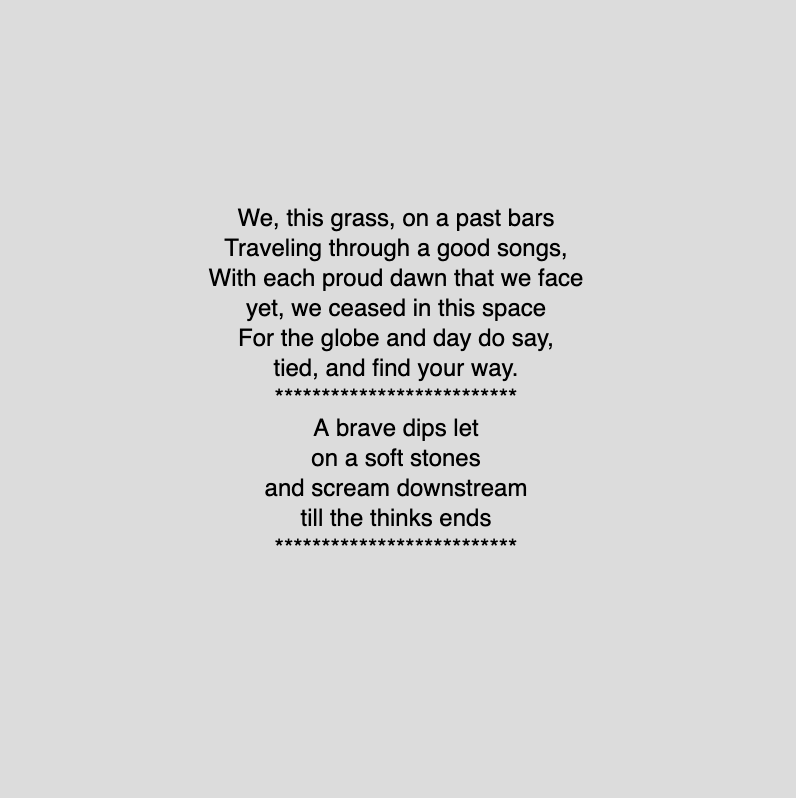

# Poem Generator

Welcome to the Poem Generator repository! This project lets you generate creative poems using a unique approach. The repository originated from the [p5js Online Editor](https://editor.p5js.org/).

## How to run?

This file is downleded from P5.js online editor, you can check it [here](https://editor.p5js.org/nastaran.moghadasi/sketches/oOILSoXQT) or simply import it on your own!

## 📂 Structure

Below is a brief outline of the main components in this repository:

- **index.html:** The main HTML file that includes necessary imports.
- **sketch.js:** The default file from the online editor. The poems are generated within the `draw` function and outputted to the console as well as in the HTML file in the browser.
- **poems.js:** Houses the inspiration set. This module returns an array of inspirational poems.
- **word-pool.js:** Contains the `getWordPool` function which creates an object comprising arrays of `nouns`, `verbs`, `adjectives`, and `adverbs`. These arrays play a vital role in the poem generation process.
- **poem-generator.js:** This is the heart of our project, the core engine. It's responsible for generating poems from the word pool and also holds the templates.

## 📚 Libraries

The Poem Generator makes use of the following libraries:

- **[RiTa](https://rednoise.org/rita/):** A powerful toolkit for computational literature.
- **[natural.js](https://www.npmjs.com/package/natural):** A general natural language facility for node, we used [Browserify](https://browserify.org/) to make it work in web. The entire library and its dependencies are in `natural.all.js`

Thank you for exploring our Poem Generator! Dive in, and let the verses flow.
